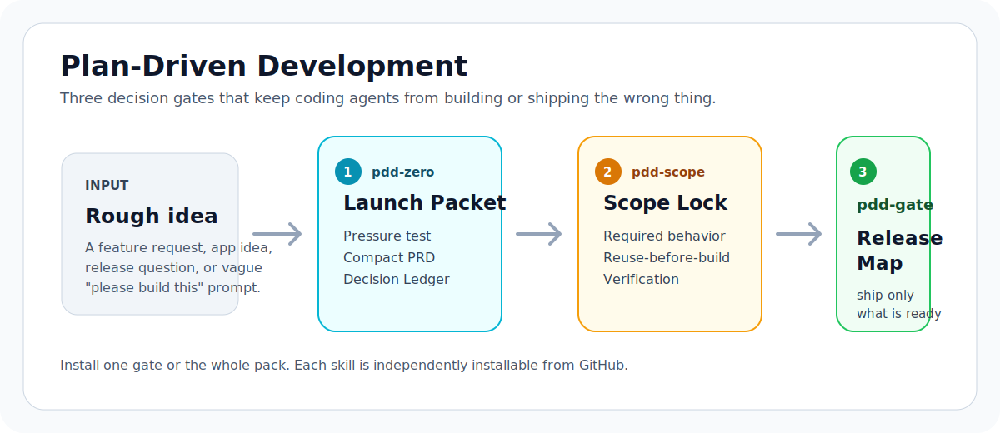
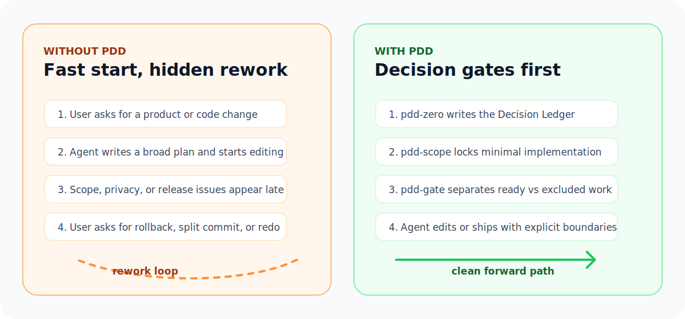

# pdd



**Plan-Driven Development skills for coding agents.**

PDD is a small skill pack that reduces agent rework by putting decision gates before expensive actions: product planning, code mutation, and release/push work.

[](LICENSE)
[](skills)
[](docs/install.md)

## The Problem

Coding agents are fast enough to create new failure modes:

- They start building before the product direction is stable.
- They implement a broader change than the user asked for.
- They mix finished work, experiments, generated files, and release metadata.
- They push or tag before blockers are visible.

PDD is not a bigger prompt. It is a set of small, installable gates that make those mistakes harder.



## The Three Gates

| Gate | Install | Best for | Output you get |
| --- | --- | --- | --- |
| `pdd-zero` | `--skill pdd-zero` | New projects, rough app ideas, MVPs, PRDs, vibe coding, `从0到1`, `新项目` | Project Launch Packet plus a Decision Ledger |
| `pdd-scope` | `--skill pdd-scope` | Implementation, fixes, refactors, scripts, migrations, automation | Scope Lock with reuse-before-build and verification |
| `pdd-gate` | `--skill pdd-gate` | Release planning, version bumps, commits, tags, pushes, `发版`, `上线` | Release Map separating ready, local, excluded, and blocked work |

## What Changes In Practice?

### Before

```text
User: Build this feature.
Agent: I made a broad plan, edited six files, added a helper, and updated release notes.
User: The release notes were not part of this. Also that helper duplicates existing code.
```

### With `pdd-scope`

```text
Scope Lock
Goal: Add the requested feature through the existing public interface.
Required behavior: ...
Non-goals: No release notes, no broad refactor, no dependency change.
Existing reuse options: Reuse the current validator and test pattern.
Minimal route: One handler change plus one behavior test.
Verification: Run the focused test and the related suite.
Stop conditions: Ask before changing the API shape or adding a dependency.
```

### Before

```text
User: Can we tag and push this?
Agent: Tests pass, so yes.
```

### With `pdd-gate`

```text
Release Map
Public/tagged: v0.2.0
Pushed: rename and packaging fixes
Committed-only: none
Uncommitted: local training samples
Excluded: assistant-sidecar, private data captures
Blockers: notarization not ready
Decision: Yellow. Safe for an internal artifact, not a public release tag.
```

## Install

Install all three skills globally for Codex:

```sh
npx skills add llfzzz/pdd --skill '*' -g -a codex -y
```

Install one skill:

```sh
npx skills add llfzzz/pdd --skill pdd-zero -g -a codex -y
npx skills add llfzzz/pdd --skill pdd-scope -g -a codex -y
npx skills add llfzzz/pdd --skill pdd-gate -g -a codex -y
```

List the skills before installing:

```sh
npx skills add llfzzz/pdd --list
```

Use the convenience script from a clone:

```sh
scripts/install.sh all
scripts/install.sh zero
scripts/install.sh scope
scripts/install.sh gate
```

GitHub CLI users with agent skill support can also install a specific skill:

```sh
gh skill install llfzzz/pdd pdd-scope
```

See [docs/install.md](docs/install.md) for more install options.

## What The CLI Sees

`npx skills add llfzzz/pdd --list` finds the three independent skills:

```text
Available Skills

  pdd-gate
    Govern releases, version bumps, commits, tags, pushes, and publishing actions...

  pdd-scope
    Lock coding scope before a coding agent edits files...

  pdd-zero
    Turn a rough product, app, website, SaaS, game, automation, or coding project idea...
```

## How To Use It

```text
Use pdd-zero to turn this rough Mac app idea into a launch packet before coding.
```

```text
Use pdd-scope before implementing this feature. I want the smallest safe change.
```

```text
Use pdd-gate to check whether this branch is ready to tag and push.
```

Chinese trigger phrases are included in the skill descriptions where useful, so prompts such as `从0到1`, `新项目`, `发版`, `上线`, and `推送版本` can route naturally.

## Why Switch From A Similar Skill?

| If you already use... | PDD adds... |
| --- | --- |
| A brainstorming or PRD skill | A Decision Ledger that records accepted assumptions, blocked decisions, reversible choices, and hard-to-change choices |
| A generic implementation planner | A Scope Lock that includes non-goals, existing reuse options, verification, and stop conditions before mutation |
| A release checklist | A Release Map that separates public, pushed, committed-only, uncommitted, excluded, and blocked work before Git actions |
| A personal prompt template | Installable, separately selectable `SKILL.md` packages with eval prompts |

## Repository Shape

```text
skills/
  pdd-zero/
    SKILL.md
    evals/evals.json
    references/project-launch-packet.md
  pdd-scope/
    SKILL.md
    evals/evals.json
  pdd-gate/
    SKILL.md
    evals/evals.json
```

Each skill is independently installable from `skills/<skill-name>/`.

## Trust And Safety

- Plain Markdown skills: inspect every instruction before installing.
- No API keys, credentials, telemetry, or hidden executable payloads.
- The only script is [scripts/install.sh](scripts/install.sh), a small wrapper around `npx skills add`.
- Evals are included so users can see the behavior each skill is meant to produce.

## References

- [Vercel skills CLI](https://github.com/vercel-labs/skills/blob/main/README.md) documents installing all skills from a repo or selecting specific skills with `--skill`.
- [Claude agent skills docs](https://docs.claude.com/en/docs/claude-code/skills) describe the `SKILL.md` directory model, frontmatter, supporting files, and testing workflow.
- [Anthropic skills repository](https://github.com/anthropics/skills) shows the public skill set convention and basic skill package shape.

## License

MIT. See [LICENSE](LICENSE).
